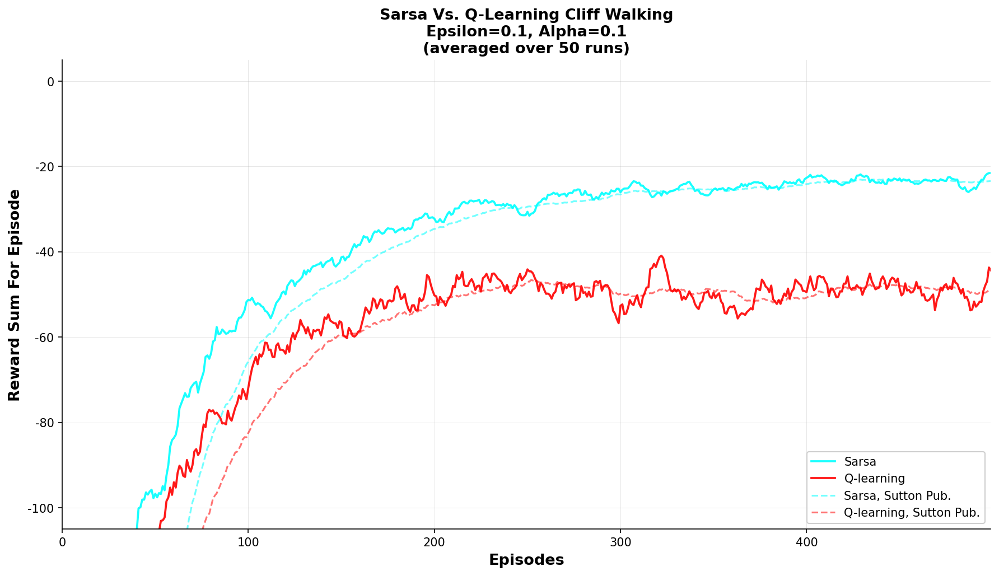
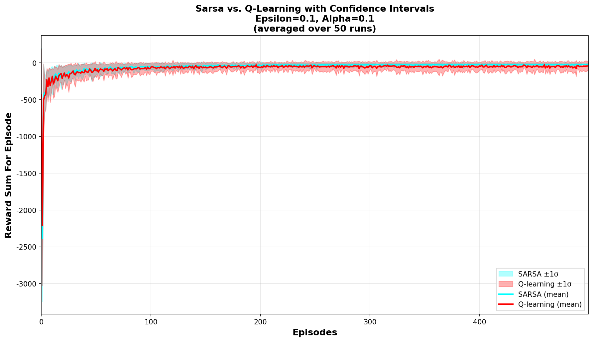
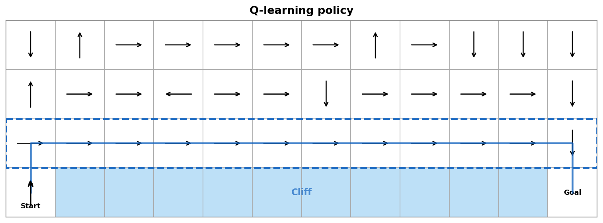
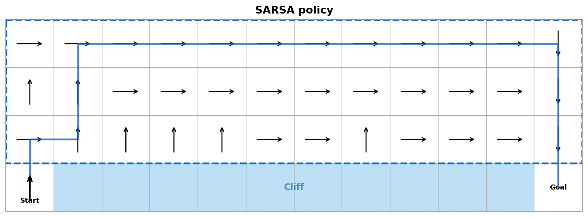

# 🏔️ Cliff Walking: Q-Learning vs SARSA

> **強化學習作業二｜互動式模擬器**  
> 🌐 **Live Demo**: https://mimimaomao11.github.io/DRL_HW2/

[](https://mimimaomao11.github.io/DRL_HW2/)

---

## 🎯 作業目的

實作並比較兩種經典強化學習演算法在 **Cliff Walking**（懸崖行走）環境中的行為：

| 演算法 | 類型 | 更新公式 |
|--------|------|----------|
| **Q-Learning** | Off-policy（離策略） | `Q(s,a) ← Q(s,a) + α[r + γ·max Q(s') − Q(s,a)]` |
| **SARSA** | On-policy（同策略） | `Q(s,a) ← Q(s,a) + α[r + γ·Q(s',a') − Q(s,a)]` |

---

## 🌐 互動式網站

直接在瀏覽器中執行模擬，**無需安裝任何東西**：

👉 **https://mimimaomao11.github.io/DRL_HW2/**

功能：
- 即時調整 α、γ、ε、Episodes、Runs 等參數
- 自動顯示 Reward 曲線與策略圖
- 結果與 Sutton & Barto 教科書圖表一致

---

## 🗺️ 環境描述

**4 × 12 格子世界（Gridworld）**：

```
Row 0: [  ][  ][  ]...[  ]  ← SARSA 學到的安全路徑
Row 1: [  ][  ][  ]...[  ]
Row 2: [  ][  ][  ]...[  ]  ← Q-Learning 學到的最短路徑
Row 3: [ S][C ][C ]...[C ][ G]
        ↑       Cliff       ↑
      Start               Goal
```

| 事件 | 獎勵 |
|------|------|
| 每移動一步 | −1 |
| 掉入懸崖 | −100，回到 Start |
| 到達 Goal | 回合結束 |

---

## 📁 專案結構

```
DRL_HW2/
├── index.html            # 互動式模擬器主頁（直接開啟即可）
├── style.css             # 深色主題 UI 樣式
├── rl.js                 # Q-Learning & SARSA 的 JavaScript 實作
│
├── cliff_env.py          # Python 環境類（學術用途）
├── rl_algorithms.py      # Python 演算法（Q-learning, SARSA）
├── train_final.py        # Python 命令列訓練腳本
├── app.py                # Flask Web 後端（選用）
├── requirements.txt      # Python 依賴
│
├── outputs_final/        # 預先產生的圖表（α=0.1 標準參數）
│   ├── reward_compare.png
│   ├── reward_with_ci.png
│   ├── policy_q.png
│   └── policy_sarsa.png
│
├── README.md             # 本文件
├── 產品規格書.md          # 功能規格書
└── ENGINEERING_WORKFLOW.md  # Agent + Reviewer 工程流程
```

---

## 🚀 本地執行

### 方式一：直接開啟網站（最簡單）

```bash
# 直接用瀏覽器開啟 index.html 即可，無需任何安裝
```

### 方式二：Python 命令列

```bash
pip install -r requirements.txt

# 使用作業標準參數（對應 Sutton & Barto 圖表）
python train_final.py --episodes 500 --runs 50 --alpha 0.1 --epsilon 0.1 --outdir outputs_final
```

| 參數 | 說明 | 預設值 |
|------|------|--------|
| `--alpha` | 學習率 α | 0.1 |
| `--gamma` | 折扣因子 γ | 0.9 |
| `--epsilon` | 探索率 ε | 0.1 |
| `--episodes` | 每次訓練回合數 | 500 |
| `--runs` | 獨立重複次數 | 50 |
| `--outdir` | 輸出目錄 | `outputs_final` |

---

## 📊 預期結果

| 指標 | Q-Learning | SARSA |
|------|-----------|-------|
| 最終平均獎勵 | ~−48 | ~−23 |
| 策略路徑 | Row 2（貼近懸崖） | Row 0（上排安全路線） |
| 訓練穩定性 | 較不穩定 | 較穩定 |
| 收斂速度 | 稍慢 | 較快 |

> **SARSA 收斂到較高的 reward** 是因為它走較長但安全的路（避崖），Q-learning 雖然理論最短路徑更優，但訓練中 ε-greedy 探索頻繁掉崖，拉低平均獎勵。

### 📈 實驗結果視覺化

#### 1. 訓練過程獎勵變化 (Reward Curve)


#### 2. 訓練過程獎勵變化含信賴區間 (Reward Curve with CI)


#### 3. Q-Learning 學習到的策略地圖 (Policy Map)


#### 4. SARSA 學習到的策略地圖 (Policy Map)


---

## 📐 理論背景

### Q-Learning（Off-policy）
使用**下一狀態最大 Q 值**更新，與實際執行的策略無關。學到的是理論最優策略，但訓練過程中若貪婪路徑鄰近懸崖，探索時常掉崖導致高 variance。

### SARSA（On-policy）
使用**實際執行的下一動作** `a'` 對應的 Q 值更新。更新反映探索策略的風險，讓 agent 學到在 ε-greedy 策略下最安全的路徑（遠離懸崖）。

> 📚 *Reinforcement Learning: An Introduction*, Sutton & Barto, 2nd Ed., Example 6.6

---

**版本**：2.0 ｜ **更新**：2026-04-25 ｜ **Live Demo**: https://mimimaomao11.github.io/DRL_HW2/
